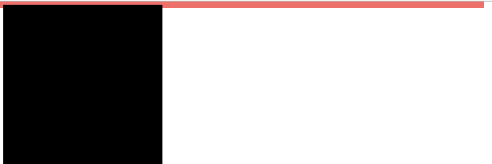
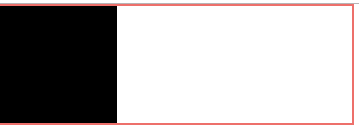
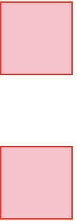
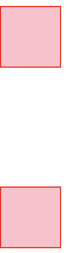

在学习前端页面布局的时候，我们经常会听到一个绕不开的名词，甚至在好多人面试的时候，会经常听到的一个词——**BFC**

那么到底什么是BFC呢？

在CSS的[官方文档](https://www.w3.org/TR/CSS21/visuren.html#block-formatting)的说明中，**BFC**:全称 *Block formatting contexts*，直译过来就是块级格式化上下文。讲到这里你可能还是一头雾水，我们这里先停下来讲几个基本的概念以便有助于你接下来的理解。

#### Formatting Context
**Formatting Context** 格式化上下文，它是指页面中一块独立的渲染区域，这块区域有自己独立的渲染规则，规则取决于这块区域的Box属性。
这套独立的规则规定渲染区域内的子元素如何定位以及和其他元素之间的相互关系

#### 页面的基本布局组成
首先，我们知道，CSS的页面布局是由一个个盒子(Box)组成的，但不同的盒子由不同的属性，内部元素的类型和display属性决定了这个盒子的属性。不同类型的盒子，会以不同的FC方式去渲染，Box基本上分为以下三类
- **Block-level Box**:`display`值为`block, list-item, table` 的元素

- **Inline-level Box**:`display`值为`inline, inline-block, inline-table`的元素

- **Run-in Box:** css3中新增的Box类型

#### BFC的定义
通过上述概念的解释，我们可以得知，所谓的 **BFC** 它是一个独立的渲染区域，只有Block-level box参与， 它规定了内部的Block-level Box如何布局，并且与这个区域外部毫不相干。

### BFC布局规则和创建
#### BFC布局规则
- 内部的Box会在垂直方向，一个接一个地放置。

- Box垂直方向的距离由margin决定。属于同一个BFC的两个相邻Box的margin会发生重叠

- 每个元素的margin box的左边， 与包含块border box的左边相接触(对于从左往右的格式化，否则相反)。即使存在浮动也是如此。

- BFC的区域不会与float box重叠。

- BFC就是页面上的一个隔离的独立容器，容器里面的子元素不会影响到外面的元素。反之也如此。

- 计算BFC的高度时，浮动元素也参与计算

#### BFC的创建（满足下列条件之一）
- 根元素或其它包含它的元素

- 浮动 (元素的 float 不是 none)

- 绝对定位的元素 (元素具有 position 为 absolute 或 fixed)

- 非块级元素具有 display: inline-block，table-cell, table-caption, flex, inline-flex

- 块级元素具有overflow ，且值不是 visible

## BFC的作用

### 清除浮动

**HTML**
```html
<div class="parents">
  <div class="child"></div>   
</div>
```
**CSS**
```css
.parents{
  width: 300px;
  background-color: blue;
}
.child{
  width:100px;
  height: 100px;
  background-color: black;
  float: left;
}
```


可以看到，父元素里面包含了一个子元素，在子元素浮动的情况下，脱离文档流，父元素高度不会被子元素撑开，这是如果我们需要让父元素被浮动的子元素撑开，根据BFC布局规则 **计算BFC的高度时，浮动元素也参与计算**，我们让父级元素生成一个BFC，则父元素内的子元素也会计算高度
可以通过以下方式生成一个BFC：
```css
.parents:{
  /*overflow: hidden;*/
  /*float: left;*/
  /*display: inline-block;*/
  /*position: absolute;*/
  }`
```

具体请参照上面BFC的创建。

### 解决外边距塌陷
**HTML**
```html
<div class="div"></div>
<div class="div"></div>
```
**CSS**
```css
.div{
  border: 1px solid red;
  width: 50px;
  height: 50px;
  margin: 50px 0;
  background-color: pink;
}
```
页面显示如下
<!-- 父元素里面包了一个子元素，子元素浮动-->

所谓的外边距塌陷是指：块级元素的上下外边距有时候会合并，合并后的外边距等于合并前两个外边距中的较大值，这种现象称为外边距塌陷
解决外边距塌陷，我们可以根据 **Box垂直方向的距离由margin决定。属于同一个BFC的两个相邻Box的margin会发生重叠** 因此，我们可以让两个p标签属于不同的BFC，则他们之间就不会发生外边距的塌陷问题
方式如下：
**HTML**
```html
<div class="div"></div>
<div class="wrap">
  <div class="div"></div>
</div>
```
**CSS**
```css
.wrap{
  overflow: hidden;
}
```
效果如下：

**BFC就是页面上的一个隔离的独立容器，容器里面的子元素不会影响到外面的元素。反之也如此**
